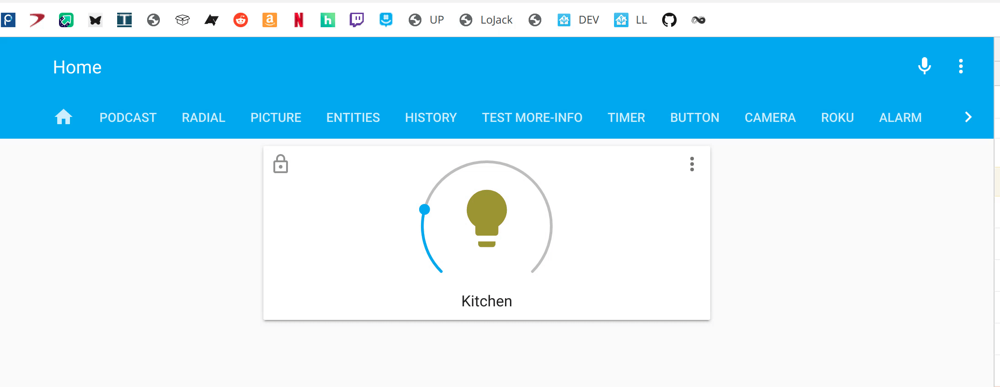
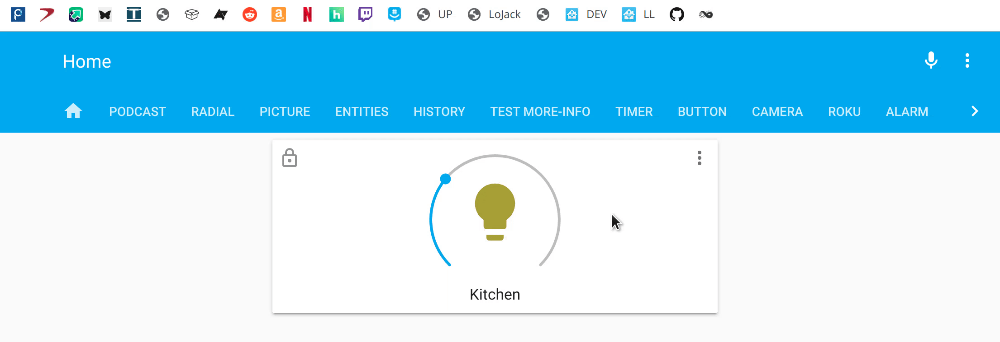
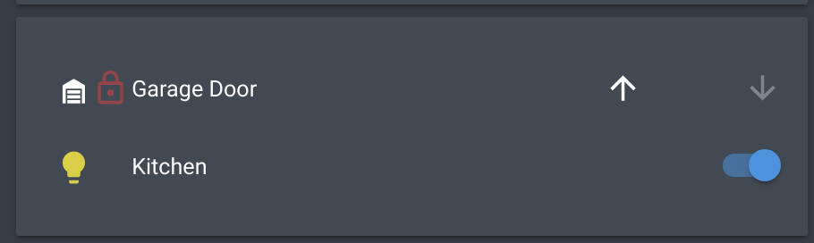

# 🔒 Restriction Card

A card to provide restrictions on Lovelace cards defined within.

## Disclaimer

This card is not to be used as a means to truly protect an instance. Someone with the means and knowledge will be able to bypass the restrictions presented by this card should they choose to.

[![GitHub Release][releases-shield]][releases]
[![License][license-shield]](LICENSE.md)
[](https://github.com/hacs/integration)

![Project Maintenance][maintenance-shield]
[![GitHub Activity][commits-shield]][commits]

[![Discord][discord-shield]][discord]
[![Community Forum][forum-shield]][forum]

## Minimum Home Assistant Version

Home Assistant version 0.110.0 or higher is required as of release 1.2.0 of restriction-card

## Support

Hey dude! Help me out for a couple of :beers: or a :coffee:!

[](https://www.buymeacoffee.com/zJtVxUAgH)

## Installation

Use [HACS](https://hacs.xyz) or follow this [guide](https://github.com/thomasloven/hass-config/wiki/Lovelace-Plugins)

```yaml
resources:
  url: /local/restriction-card.js
  type: module
```

## Options

| Name          | Type    | Requirement  | Description                                                                                     |
| ------------- | ------- | ------------ | ----------------------------------------------------------------------------------------------- |
| type          | string  | **Required** | `custom:restriction-card`                                                                       |
| card          | map     | **Required** | Card to render within `restriction-card`.                                                       |
| restrictions  | map     | **Optional** | Additional restrictions. See [Restrictions Options](#restrictions-options).                     |
| exemptions    | list    | **Optional** | List of exemption objects. See [Exemption Options](#exemption-options).                         |
| condition     | map     | **Optional** | Conditional object to make lock active. See [Condition Options](#condition-options).            |
| row           | boolean | **Optional** | Set to true to give a default `margin:left: 24px`                                               |
| duration      | number  | **Optional** | Duration of unlock in seconds. Default is `5`                                                   |
| action        | string  | **Optional** | Action type to trigger the unlock. Options are `tap`, `double_tap`, or `hold`. Default is `tap` |
| locked_icon   | string  | **Optional** | Icon to show when locked. Default is `mdi:lock-outline`                                         |
| unlocked_icon | string  | **Optional** | Icon to show when unlocked instead of fading the icon away                                      |

## Restrictions Options

| Name    | Type | Requirement  | Description                                                               |
| ------- | ---- | ------------ | ------------------------------------------------------------------------- |
| confirm | map  | **Optional** | Confirmation unlock restriction. See [Confirm Options](#confirm-options). |
| pin     | map  | **Optional** | Pin code restriction. See [Pin Options](#pin-options).                    |
| block   | map  | **Optional** | Block interaction restriction. See [Block Options](#block-options).       |
| hide    | map  | **Optional** | Hide card restriction. See [Hide Options](#hide-options)..                |

## Confirm Options

| Name       | Type   | Requirement  | Description                                                                                 |
| ---------- | ------ | ------------ | ------------------------------------------------------------------------------------------- |
| text       | string | **Optional** | Text to display in confirmation dialog                                                      |
| exemptions | list   | **Optional** | List of exemption objects. See [Exemption Options](#exemption-options).                     |
| condition  | map    | **Optional** | Conditional object to make restriction active. See [Condition Options](#condition-options). |

## Pin Options

| Name              | Type   | Requirement  | Description                                                                                                               |
| ----------------- | ------ | ------------ | ------------------------------------------------------------------------------------------------------------------------- |
| code               | string/list  | **Required** | Pin code the user needs to enter to unlock. Could be a list of codes                                                                                |
| text              | string | **Optional** | Text to display in prompt dialog                                                                                          |
| exemptions        | list   | **Optional** | List of exemption objects. See [Exemption Options](#exemption-options).                                                   |
| condition         | map    | **Optional** | Conditional object to make restriction active. See [Condition Options](#condition-options).                               |
| retry_delay       | number | **Optional** | Number of seconds that you want to delay next attempt to unlock. Default is `0`                                           |
| max_retries       | number | **Optional** | Number of consecutive invalid retries allowed before blocking for the `max_retries_delay` seconds. Default is `unlimited` |
| max_retries_delay | number | **Optional** | Number of seconds to block attempts to unlock after the `max_retries` has been reached                                    |

## Block Options

| Name       | Type   | Requirement  | Description                                                                                 |
| ---------- | ------ | ------------ | ------------------------------------------------------------------------------------------- |
| text       | string | **Optional** | Text to display in alert                                                                    |
| exemptions | list   | **Optional** | List of exemption objects. See [Exemption Options](#exemption-options).                     |
| condition  | map    | **Optional** | Conditional object to make restriction active. See [Condition Options](#condition-options). |

## Hide Options

| Name       | Type | Requirement  | Description                                                                                 |
| ---------- | ---- | ------------ | ------------------------------------------------------------------------------------------- |
| exemptions | list | **Optional** | List of exemption objects. See [Exemption Options](#exemption-options).                     |
| condition  | map  | **Optional** | Conditional object to make restriction active. See [Condition Options](#condition-options). |

## Exemption Options

| Name | Type   | Requirement  | Description                                                |
| ---- | ------ | ------------ | ---------------------------------------------------------- |
| user | string | **Required** | User id to exempt. This is found in the user profile `ID`. |

## Condition Options

| Name      | Type   | Requirement  | Description                                                                                         |
| --------- | ------ | ------------ | --------------------------------------------------------------------------------------------------- |
| value     | string | **Required** | String representing the state.                                                                      |
| entity    | string | **Required** | Entity to use condition and is what also causes the card to update                                  |
| attribute | string | **Optional** | Attribute of the entity to use instead of the state.                                                |
| operator  | string | **Optional** | Operator to use in the comparison. Can be `==`,`<=`,`<`,`>=`,`>`,`!=`, or `regex`. Default is `==`. |

## Theme Variables

The following variables are available and can be set in your theme to change the appearance of the lock.
Can be specified by color name, hexadecimal, rgb, rgba, hsl, hsla, basically anything supported by CSS.

| name                               | Default              | Description                                            |
| ---------------------------------- | -------------------- | ------------------------------------------------------ |
| `restriction-regular-lock-color`   | `primary-text-color` | Lock color                                             |
| `restriction-success-lock-color`   | `primary-color`      | Lock color when unlocked                               |
| `restriction-blocked-lock-color`   | `error-state-color`  | Lock color when card is blocked                        |
| `restriction-invalid-lock-color`       | `error-state-color`  | Lock color after an invalid attempt to unlock          |
| `restriction-lock-margin-left`     | `0px`                | Manually set the left margin of the lock icon (right for RTL)          |
| `restriction-lock-margin-top`     | `0px`                | Manually set the top margin of the lock icon          |
| `restriction-lock-row-margin-left` | `24px`               | Manually set the left margin of the lock icon in a row (right for RTL) |
| `restriction-lock-row-margin-top`  | `0px`                | Manually set the top margin of the lock icon in a row |
| `restriction-lock-icon-size`       | `24px`               | Lock icon size                                         |
| `restriction-lock-opacity`         | `0.5`                | Lock icon opacity                                      |
| `restriction-overlay-background`        | `unset`              | Overlay background when locked                          |
| `restriction-overlay-row-outline`       | `none`               | Outline for an overlay in a row when locked             |
| `restriction-overlay-background-blocked`  | `unset`            | Overlay background when blocked                         |
| `restriction-overlay-row-outline-blocked` | `none`             | Outline for an overlay in a row when blocked            |
| `restriction-overlay-row-border-radius` | `0`                  | Border radius for an overlay in a row                   |

Note: it is not recommended to set negative values for `*-lock-*-margin-*` variables to prevent a "lock" icon to be clipped.

## Example Configurations

Simple Lock example



```yaml
type: custom:restriction-card
card:
  type: thermostat
  entity: climate.house
```

More complex example



```yaml
type: custom:restriction-card
restrictions:
  confirm:
    exemptions:
      - user: adminid
  pin:
    code: 1234
    exemptions:
      - user: wifeid
      - user: adminid
  block:
    exemptions:
      - user: guestid
      - user: wifeid
      - user: adminid
exemptions:
  - user: ianid
card:
  type: thermostat
  entity: climate.house
```

Row example



```yaml
type: 'custom:hui-entities-card'
entities:
  - card:
      entity: cover.garage_door
    restrictions:
      block: true
    type: 'custom:restriction-card'
    row: true
  - entity: light.kitchen
```

Overlay background example

Card locked:


```yaml
type: custom:restriction-card
card:
  type: entities
  entities:
    - entity: switch.test_switch
```

Row locked:


```yaml
type: entities
entities:
  - type: custom:restriction-card
    row: true
    card:
      entity: switch.test_switch
```

Card blocked:


```yaml
type: custom:restriction-card
restrictions:
  block: true
card:
  type: entities
  entities:
    - entity: switch.test_switch
```

Row blocked:


```yaml
type: entities
entities:
  - type: custom:restriction-card
    restrictions:
      block: true
    row: true
    card:
      entity: switch.test_switch
```

Theme file:
```yaml
  restriction-overlay-background: repeating-linear-gradient( -45deg, transparent 0 10px,var(--user-restriction-card-mask,rgba(255,0,0,0.07)) 10px 20px)
  restriction-overlay-background-blocked: repeating-linear-gradient( -45deg, transparent 0 10px,var(--user-restriction-card-mask,rgba(127,127,127,0.07)) 10px 20px)
  restriction-lock-opacity: 0
  restriction-overlay-row-border-radius: 4px
  restriction-overlay-row-outline: 1px solid rgba(255,0,0,0.1)
  restriction-overlay-row-outline-blocked: 1px solid rgba(127,127,127,0.1)
```

Multiple pin codes example
```
...
restrictions:
  pin:
    code:
      - abc1234
      - 1234
      - "0000"
      - 5656
      - 12
      - "0012"
    text: Enter pin to unlock
...
```
Notes:
1. Numerical values with leading zeros may be mistreated. To avoid this, wrap values in quotes.
2. Dependently on a presence of alpha-numeric pin codes (like `abcd`, `abcd1234`, `12 34`, `12.24`, `12,34`) in the `code` option, a particular "enter pin" dialog is shown: if all values are numerical - a numerical keypad is shown, otherwise - a simple input-box allowing to input any characters.

<hr style="border: 1px soild gray">

Special Consideration for Input Selects:

If you find that the restriction card is blocking something you don't want blocked like an input select, try adjusting the z-index using mod-card
```
card:
  type: custom:mod-card
  card_mod:
    style: |
      ha-card {
        z-index: 7;
        }
  card:
    type: custom:restriction-card
```

## [Troubleshooting](https://github.com/thomasloven/hass-config/wiki/Lovelace-Plugins)

[commits-shield]: https://img.shields.io/github/commit-activity/y/custom-cards/restriction-card.svg?style=for-the-badge
[commits]: https://github.com/custom-cards/restriction-card/commits/master
[discord]: https://discord.gg/5e9yvq
[discord-shield]: https://img.shields.io/discord/330944238910963714.svg?style=for-the-badge
[forum-shield]: https://img.shields.io/badge/community-forum-brightgreen.svg?style=for-the-badge
[forum]: https://community.home-assistant.io/t/lovelace-restriction-card-client-side-security/142889
[license-shield]: https://img.shields.io/github/license/custom-cards/restriction-card.svg?style=for-the-badge
[maintenance-shield]: https://img.shields.io/badge/maintainer-Ian%20Richardson%20%40iantrich-blue.svg?style=for-the-badge
[releases-shield]: https://img.shields.io/github/release/custom-cards/restriction-card.svg?style=for-the-badge
[releases]: https://github.com/custom-cards/restriction-card/releases
